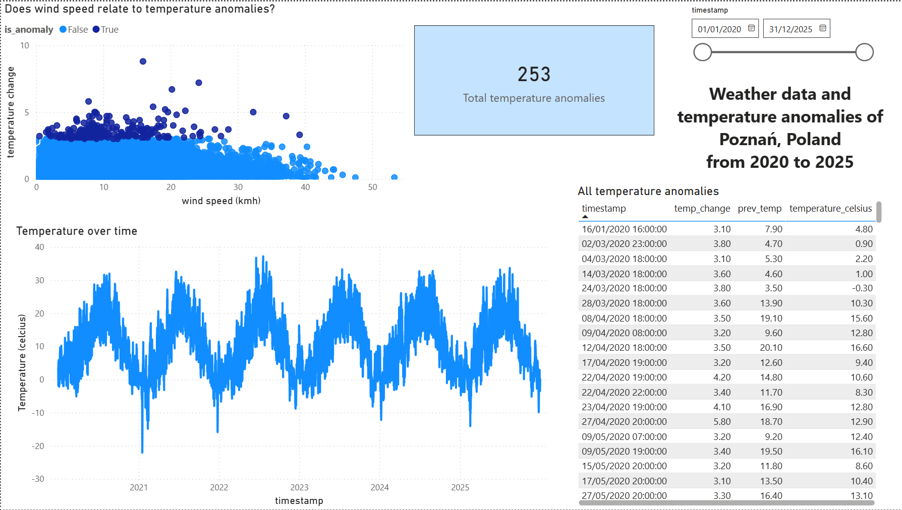

# Weather Sensor Pipeline: Anomaly Detection

## Project Overview
This project extracts hourly environmental sensor data of the past 5 years via a Open Meteo REST API, processes the deeply nested columnar JSON using Apache Spark (Databricks), stores the data in serverless data werehouse which is connected to PowerBI.

##  Architecture & Tech Stack
* **Extraction:** Python (`requests`) pulling historical time-series data from the Open-Meteo REST API.
* **Transformation:** PySpark (`arrays_zip`, `explode`, `Window` functions) to flatten nested JSON and calculate hour-over-hour volatility.
* **Storage:** Databricks Serverless Data Warehouse / Delta Tables. 
* **Visualization (BI):** Power BI Desktop 

## Key  Insights
By analyzing 8,760 hours of continuous sensor telemetry, the pipeline revealed:
1. **Anomaly Frequency:** Identified critical instances where the temperature fluctuated by more than 3°C within a single 60-minute window.
2. **Root-Cause Analysis:** Initially i suspected these fluctuations to be caused by high wind speeds altering the readings, so i mapped temperature changes against wind telemetry. **Result:** No statistical correlation was found between high wind speeds and temperature anomalies, suggesting that rapid temperature shifts are likely driven by internal hardware malfunctions or simulated mechanical events rather than atmospheric wind fronts.

## Dashboard

